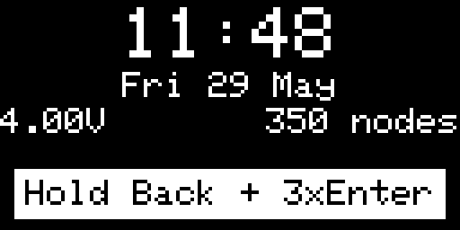
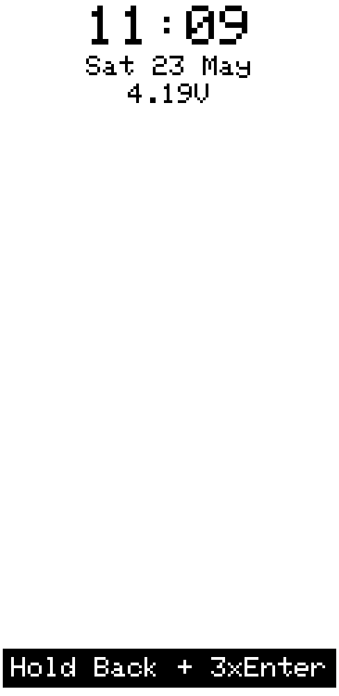
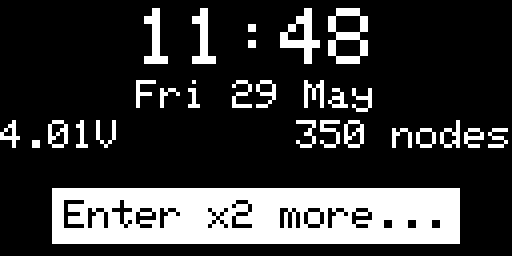
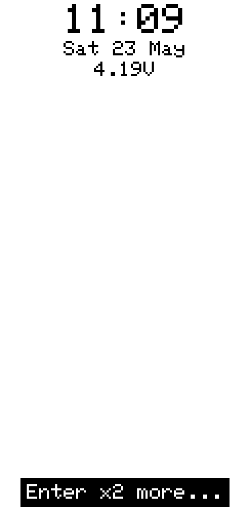

## Screen Lock

[Go back](../../../README.md)

### Overview

|           OLED            |           E-Ink           |
| :-----------------------: | :-----------------------: |
|  |  |

Screen lock prevents accidental keypresses. While locked the display turns off and all input is ignored.

---

### Locking and unlocking

**Hold Back** and press **Enter** three times within 3 seconds. The sequence works in both directions — the same combination locks and unlocks.

If the display is off when the sequence begins, it turns on automatically so the hint is visible. Each press in the sequence extends the display-on timer by 5 seconds.

The hint popup at the bottom of the lock screen guides through the sequence:

| Step           | Hint                  |
| -------------- | --------------------- |
| Not started    | _Hold Back + 3×Enter_ |
| 1 press done   | _Enter ×2 more…_      |
| 2 presses done | _Enter ×1 more…_      |

If no press is made for 3 seconds, the counter resets.

---

### Lock screen

|           OLED            |           E-Ink           |
| :-----------------------: | :-----------------------: |
|  |  |

A brief press of any button wakes the display and shows the lock screen. It displays:

- **Time** — large, same format as the Clock page (24 h / 12 h from Settings)
- **Date** — day-of-week, day, month
- **Two sensor values** — the first two Dashboard Config fields (same values configured for the Clock page); shown side by side if both are set

The display turns off again automatically after 5 seconds of inactivity (or 2 seconds immediately after locking).

---

### Auto-lock

Enable **Auto-lock** in **Settings › Display** to lock the device automatically whenever the display turns off due to auto-off timeout. With auto-lock on, the device is always locked after the screen goes dark — no manual lock needed.
